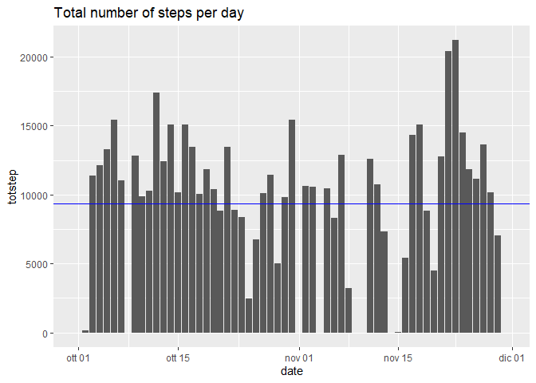
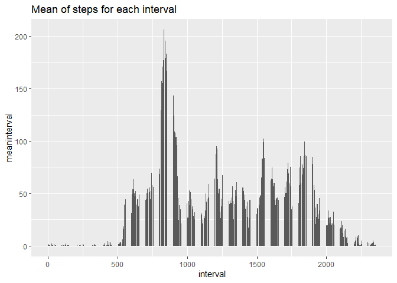
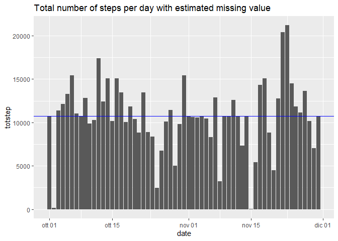
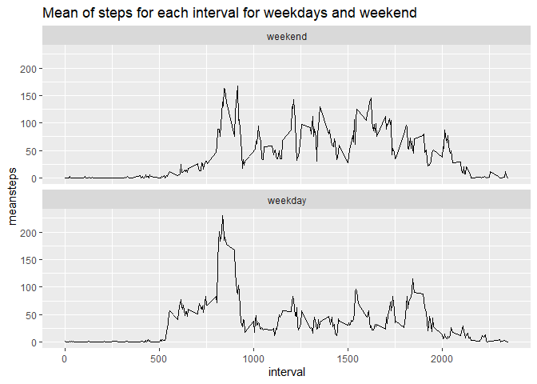

---

title: "Reproducible Research: Peer Assessment 1"
output: 
  html_document:
    keep_md: true
---


## Loading and preprocessing the data
This section includes the code for reading the activity file from the .zip directory in the repository and process/transfrom the data to have it suitable for the purpose. Date column will be defined as Date class 


```r
zipFile <- unzip("activity.zip", list=TRUE)
activity <- read.csv(unz("activity.zip",as.character(zipFile$Name)), header=TRUE)
activity$date <- as.Date(activity$date)
```

## What is the total number of steps taken per day?  
## What are mean and median of total number of steps taken per day?
The following dataframe shows the total number of steps, mean and median per day. Furthermore a Histogram has been built showing the totalstep per day

```r
activitydate <-group_by(activity,date)
statnumsteps <- summarise(activitydate, totstep=sum(steps,na.rm = TRUE),meanstep=mean(steps,na.rm = TRUE),medianstep=mean(steps,na.rm = TRUE))
```

```
## `summarise()` ungrouping output (override with `.groups` argument)
```

```r
print(statnumsteps)
```

```
## # A tibble: 61 x 4
##    date       totstep meanstep medianstep
##    <date>       <int>    <dbl>      <dbl>
##  1 2012-10-01       0  NaN        NaN    
##  2 2012-10-02     126    0.438      0.438
##  3 2012-10-03   11352   39.4       39.4  
##  4 2012-10-04   12116   42.1       42.1  
##  5 2012-10-05   13294   46.2       46.2  
##  6 2012-10-06   15420   53.5       53.5  
##  7 2012-10-07   11015   38.2       38.2  
##  8 2012-10-08       0  NaN        NaN    
##  9 2012-10-09   12811   44.5       44.5  
## 10 2012-10-10    9900   34.4       34.4  
## # ... with 51 more rows
```

```r
ggplot(statnumsteps,aes(x=date,y=totstep))+geom_bar(stat="identity") +  labs(title = "Total number of steps per day") + geom_hline(yintercept = mean(statnumsteps$totstep), color="blue")
```

<!-- -->


## What is the average daily activity pattern?
The activity DF is grouped by interval in order then to summarise in a new DF the mean of steps of each interval.  Then it follows a time series plot of the 5-minute interval (x-axis) and the average number of steps taken, averaged across all days (y-axis). Finally it is indicated the 5-minute interval that contains the maximum average number of steps

```r
activityinterval <- group_by(activity,interval)
activityinterval <- arrange(activityinterval,interval)
statpatternday <- summarise(activityinterval,meaninterval=mean(steps,na.rm=TRUE))
```

```
## `summarise()` ungrouping output (override with `.groups` argument)
```

```r
ggplot(statpatternday,aes(x=interval,y=meaninterval),type="l")+geom_bar(stat="identity") +  labs(title = "Mean of steps for each interval")
```

<!-- -->

```r
maxvalue <- filter(statpatternday,meaninterval==max(statpatternday$meaninterval))
maxnumber <- maxvalue[1,2]
maxinterval <- maxvalue[1,1]
print(paste0("The maximum average number of steps is ", maxnumber, " that corrisponds to the 5-minutes interval number " ,maxinterval))
```

```
## [1] "The maximum average number of steps is 206.169811320755 that corrisponds to the 5-minutes interval number 835"
```


## Imputing missing values
In the activity file are contained several NA values. The code will count that number and will substitute NA with the mean of the corrisponding 5 minutes value already calculated in the DF statpatternday creating a new DF named activitycomplete having all the missing value properly filled

```r
numberNA <- sum(is.na(activity$steps))
activitycomplete <- activity
whereNA <- is.na(activity$steps)
for (i in 1:nrow(activity)) {
    if (whereNA[i]) {
        valueforNA <- filter(statpatternday,interval == activity$interval[i])
        activitycomplete$steps[i] <- valueforNA$meaninterval
    } 
}

print(paste0("The number of missing data in the activity data frame is ", numberNA))    
```

```
## [1] "The number of missing data in the activity data frame is 2304"
```


## Compare results filling the NA value
Finally the total steps per day, mean and median are calculated to be compared with the previous statistics. Total steps graph is showed to compare with the corrisponding graph that was produced not considering NA value. Impacts on imputing missing value is that we have an average number of steps per day greater than before, probably a closer value to the reality (greater than in the case of the data set with the missing value above). 


```r
activitydatecomplete <-group_by(activitycomplete,date)
statnumstepscomplete <- summarise(activitydatecomplete, totstep=sum(steps,na.rm = TRUE),meanstep=mean(steps,na.rm = TRUE),medianstep=mean(steps,na.rm = TRUE))
```

```
## `summarise()` ungrouping output (override with `.groups` argument)
```

```r
print(statnumstepscomplete)
```

```
## # A tibble: 61 x 4
##    date       totstep meanstep medianstep
##    <date>       <dbl>    <dbl>      <dbl>
##  1 2012-10-01  10766.   37.4       37.4  
##  2 2012-10-02    126     0.438      0.438
##  3 2012-10-03  11352    39.4       39.4  
##  4 2012-10-04  12116    42.1       42.1  
##  5 2012-10-05  13294    46.2       46.2  
##  6 2012-10-06  15420    53.5       53.5  
##  7 2012-10-07  11015    38.2       38.2  
##  8 2012-10-08  10766.   37.4       37.4  
##  9 2012-10-09  12811    44.5       44.5  
## 10 2012-10-10   9900    34.4       34.4  
## # ... with 51 more rows
```

```r
ggplot(statnumstepscomplete,aes(x=date,y=totstep))+geom_bar(stat="identity")+  labs(title = "Total number of steps per day with estimated missing value")+ geom_hline(yintercept = mean(statnumstepscomplete$totstep), color="blue")
```

<!-- -->


## Are there differences in activity patterns between weekdays and weekends?
A new factor variable has been created in the complete data set activity (without missing value) that indicate if the day is weekday or weekend. Then a panel plot is displayed, containing a time series plot of the 5-minute interval (x-axis) and the average number of steps taken, averaged across all weekday days or weekend days (y-axis).

```r
weekdays1 <- c('lunedì', 'martedì', 'mercoledì', 'giovedì', 'venerdì')
weekday <- factor((weekdays(activitydatecomplete$date) %in% weekdays1), levels=c(FALSE, TRUE), labels=c('weekend', 'weekday')) 
activitydatecompleteind <- cbind(activitydatecomplete,weekday)
```

```
## New names:
## * NA -> ...4
```

```r
namecol <- c(names(activitydatecomplete),"weekday")
colnames(activitydatecompleteind) <- namecol
activitydatecompleteind$weekday <- as.factor(activitydatecompleteind$weekday)
activityintervalind <- group_by(activitydatecompleteind,weekday,interval)
activityintervalind <- arrange(activityintervalind,weekday,interval)
statpatterndayind <- summarise(activityintervalind,meansteps=mean(steps,na.rm=TRUE))
```

```
## `summarise()` regrouping output by 'weekday' (override with `.groups` argument)
```

```r
ggplot(statpatterndayind,aes(x=interval,y=meansteps),type="l")+geom_line(stat="identity") +  labs(title = "Mean of steps for each interval for weekdays and weekend")+facet_wrap(~weekday,ncol = 1)
```

<!-- -->
